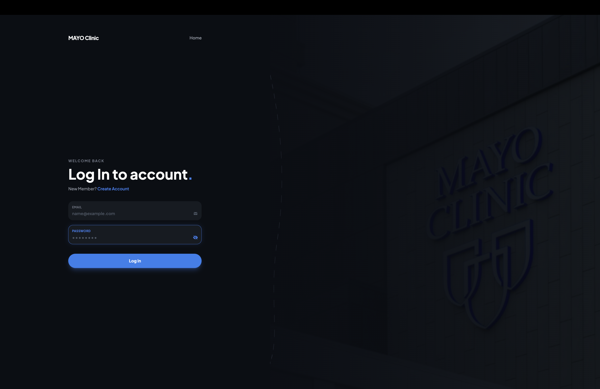
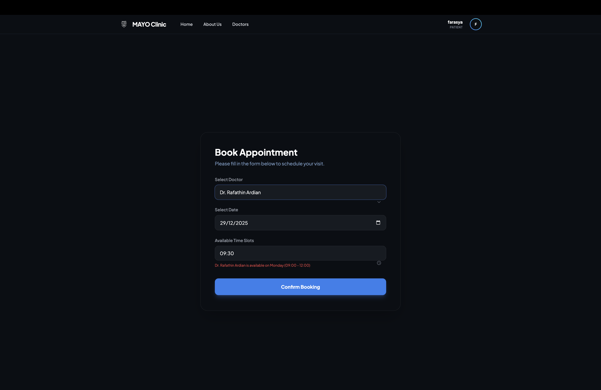
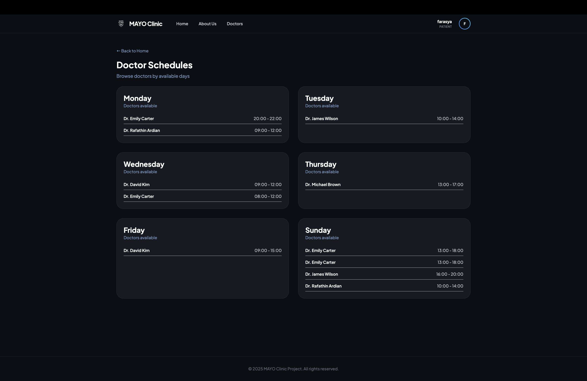

<div align="center">

# 🏥 Clinic Appointment System
**Sistem Informasi Manajemen Janji Temu Klinik Terintegrasi**

<p align="center">
  <a href="#gambaran-umum">Gambaran Umum</a> •
  <a href="#fitur-utama">Fitur Utama</a> •
  <a href="#desain-basis-data">Desain</a> •
  <a href="#teknologi">Teknologi</a> •
  <a href="#cara-menjalankan">Instalasi</a> •
  <a href="#struktur-direktori">Struktur Folder</a> •
  <a href="#tampilan-aplikasi">Galeri</a>
</p>

</div>

---

## 🏛️ Identitas Proyek

**Final Report Mata Kuliah MII212501 - Basis Data (Kelas KOMA)** <br>
Departemen Ilmu Komputer dan Elektronika, FMIPA UGM - Semester Gasal 2025

### 👥 Kelompok 7

| NIM | Nama Anggota |
| :--- | :--- |
| 24/543832/PA/23111 | Aliya Khairun Nisa |
| 24/543855/PA/23113 | Farsya Nabila Tori |
| 24/541739/PA/22991 | Gracella Wiendy Koesnadi |

---

## <a id="gambaran-umum"></a>📋 Gambaran Umum

**Clinic Appointment System (MAYO Clinic)** adalah aplikasi berbasis web yang dirancang untuk mengatasi inefisiensi pendaftaran manual di klinik. Sistem ini mengintegrasikan proses pendaftaran pasien, penjadwalan dokter, dan pencatatan rekam medis ke dalam satu *database* terpusat.

**Masalah Utama:**
Sistem manual menyebabkan antrean panjang, kesulitan pengelolaan jadwal dokter, dan risiko kehilangan data rekam medis pasien.

**Solusi yang Ditawarkan:**
Aplikasi ini menyediakan *Role-Based Access Control* (RBAC) untuk tiga entitas utama:
1.  **Pasien:** Dapat melakukan *booking* mandiri dan melihat riwayat medis.
2.  **Dokter:** Manajemen jadwal praktik dan input diagnosis pasien.
3.  **Resepsionis:** Menangani pendaftaran *walk-in* dan manajemen operasional klinik.

---

## <a id="fitur-utama"></a>🚀 Fitur Utama

Sistem ini memiliki alur kerja yang komprehensif untuk setiap pengguna, yakni sebagai berikut.

| Peran | Fitur Utama |
| :--- | :--- |
| **Pasien** 🧑‍ | • **Booking Online:** Memilih dokter dan slot waktu yang tersedia.<br>• **Medical History:** Akses riwayat janji temu dan catatan diagnosis dokter.<br>• **Profile Management:** Update data pribadi secara mandiri. |
| **Dokter** 👨‍⚕️ | • **Dynamic Scheduling:** Menambah, mengubah, atau menghapus slot praktik.<br>• **Dashboard Statistik:** Visualisasi jumlah pasien harian secara *real-time*.<br>• **Medical Record Input:** Mencatat diagnosis dan resep obat pasca-pemeriksaan. |
| **Resepsionis** 👩‍💼 | • **Walk-in Appointment:** Mendaftarkan pasien yang datang langsung (tanpa akun).<br>• **Doctor Availability:** Melihat visualisasi kartu jadwal seluruh dokter.<br>• **Patient Management:** Membantu registrasi akun pasien baru. |

---

## <a id="desain-basis-data"></a>🗄️ Desain Basis Data

Proyek ini menggunakan basis data relasional **MySQL** yang telah dinormalisasi hingga **3NF** untuk menjamin integritas data.

### 🔑 Constraints 
*Constraints* SQL diterapkan untuk menjaga konsistensi logika, yakni

* **ON DELETE CASCADE:** Diterapkan pada relasi `Dokter` dan `Appointment`. Jika data dokter dihapus, jadwal appointment terkait akan otomatis terhapus untuk mencegah *ghost schedule*.
* **ON DELETE SET NULL:** Diterapkan pada relasi `Resepsionis` dan `Appointment`. Jika akun resepsionis dihapus, riwayat transaksi medis pasien tetap aman (tidak hilang), hanya kolom penanggung jawab yang menjadi NULL.
* **Secure Hashing:** Password pengguna disimpan dalam format terenkripsi menggunakan `pbkdf2:sha256` (Werkzeug Security).

---

## <a id="teknologi"></a>💻 Teknologi

* **Backend:** Python (Flask Framework)
* **Database:** MySQL (Deployed on Railway)
* **Frontend:** HTML5, CSS3, Jinja2 Templates
* **Security:** Werkzeug Security (Password Hashing)

---

## <a id="cara-menjalankan"></a>⚙️ Cara Menjalankan

### 1. Clone Repository
```bash
git clone [https://github.com/gracella12/DBProject_Group7_Clinic-Appointment-System.git](https://github.com/gracella12/DBProject_Group7_Clinic-Appointment-System.git)
cd Clinic-Appointment-System/week4_integration
```

### 2. Setup Virtual Environment 
```bash
python -m venv venv
# Windows
venv\Scripts\activate
# Mac/Linux
source venv/bin/activate
```

### 3. Install Dependencies
```bash
pip install -r requirements.txt
```
### 4. Konfigurasi Database
```bash
Buka file `app.py`, cari bagian konfigurasi app.config, dan sesuaikan dengan kredensial MySQL lokal Anda:
```python
# app.py
app.config['MYSQL_HOST'] = 'localhost'
app.config['MYSQL_USER'] = 'root'
app.config['MYSQL_PASSWORD'] = 'masukkan_password_anda' 
app.config['MYSQL_DB'] = 'clinic_system'
```

### 5. Jalankan Aplikasi
```bash
python app.py
```
---

## <a id="struktur-direktori"></a>📂 Struktur Direktori
Berikut adalah susunan folder dalam repositori ini.
```text
DBProject_Group7_Clinic-Appointment-System/
├── week1_proposal_ERD/              # Tahap 1: Desain Awal & ERD
│   ├── ER Diagram [REVISED].png
│   └── Proposal_ERD_Group 7 [REVISED].pdf
│
├── week2_schema_sql/                # Tahap 2: Skema Database & Normalisasi
│   ├── clinic_system.sql
│   ├── logical_schema.png
│   └── normalization_explained.pdf  # Penjelasan Normalisasi (1NF-3NF)
│
├── week3_CRUD_demo/                 # Tahap 3: Prototipe Fungsi CRUD Dasar
│   ├── templates/
│   ├── app.py
│   └── crud_explained.pdf           # Penjelasan Logika Create, Read, Update, Delete
│
├── week4_integration/               # ⭐️ APLIKASI UTAMA (Final Integration)
│   ├── static/                      # Aset (CSS/JS/Images)
│   ├── templates/                   # File HTML Frontend
│   ├── venv/                        # Virtual Environment
│   ├── app.py                       # Main Application Logic
│   ├── requirements.txt             # Daftar Library Python
│   ├── tailwind.config.js           # Konfigurasi Tailwind CSS
│   └── ...
│
├── DBProject-2.sql                  # Dump Database Final
└── README.md                        # Dokumentasi Proyek
```
---

## <a id="tampilan-aplikasi"></a>📸 Tampilan Aplikasi
Berikut adalah cuplikan antarmuka dari MAYO Clinic System:

| **Halaman Login** | **Homepage Pasien** |
| :---: | :---: |
|  |  |
| *Autentikasi Aman* | *Navigasi Utama* |

| **Formulir Janji Temu** | **Jadwal Dokter** |
| :---: | :---: |
|  |  |
| *Input Booking* | *Informasi Jadwal* |

---
<div align="center">

Made with 🩷 by Kelompok 7 Basis Data KOMA UGM

</div>